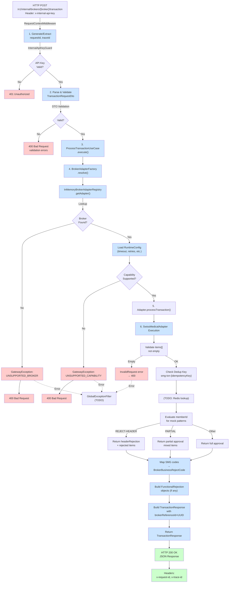

# LIS Broker Gateway — Comprehensive Architecture Analysis

**Date**: 2026-07-02  
**Project**: lis-broker-gateway (NestJS)  
**Base Path**: `c:\Projects\LIS\lis-broker-gateway`

---

## Executive Summary

The lis-broker-gateway is a **hexagonal architecture monolith** (Ports & Adapters pattern) designed to decouple the Laravel LIS core from broker/health provider integrations in Argentina. The system:

- Supports **3 adapters** (Swiss Medical, IMED, Traditum) via in-memory registry
- Provides **5 broker capabilities** (Eligibility, Transaction, Authorization, Cancellation, StatusQuery)
- Maps broker-specific rejection codes to canonical business reject codes
- Implements idempotency logging (not yet backed by Redis/DB)
- Prepared for async SQS and token-based authentication
- Uses NestJS 10.4.2 with class-validator/transformer for DTO validation

---

## Architecture Overview

### Layer Diagram

```
┌─────────────────────────────────────────────────────────────┐
│ INTERFACES (HTTP)                                           │
│ ┌──────────────────────────────────────────────────────────┤
│ │ InternalBrokersController                                │
│ │ POST   /v1/internal/brokers/{broker}/eligibility        │
│ │ POST   /v1/internal/brokers/{broker}/transaction        │
│ │ GET    /v1/internal/brokers/{broker}/capabilities       │
│ └──────────────────────────────────────────────────────────┘
└─────────────────────────────────────────────────────────────┘
                              ↓
┌─────────────────────────────────────────────────────────────┐
│ APPLICATION (Use Cases & Services)                          │
│ ┌──────────────────────────────────────────────────────────┤
│ │ ValidateEligibilityUseCase                               │
│ │ ProcessTransactionUseCase                                │
│ │ GetBrokerCapabilitiesUseCase                             │
│ │                                                          │
│ │ BrokerAdapterFactory (resolve broker + runtime config)  │
│ └──────────────────────────────────────────────────────────┘
└─────────────────────────────────────────────────────────────┘
                              ↓
┌─────────────────────────────────────────────────────────────┐
│ DOMAIN (Ports & Models)                                     │
│ ┌──────────────────────────────────────────────────────────┤
│ │ BrokerAdapterPort (interface)                            │
│ │ BrokerAdapterRegistryPort (interface)                    │
│ │                                                          │
│ │ Models: BrokerCapability, Transaction*, Eligibility*    │
│ │ Models: FunctionalRejection, BrokerError                │
│ │ Models: RequestContext, BrokerRuntimeConfig             │
│ └──────────────────────────────────────────────────────────┘
└─────────────────────────────────────────────────────────────┘
                              ↓
┌─────────────────────────────────────────────────────────────┐
│ INFRASTRUCTURE (Adapters & Registry)                        │
│ ┌──────────────────────────────────────────────────────────┤
│ │ InMemoryBrokerAdapterRegistry                            │
│ │ ├─ SwissMedicalAdapter (prod-ready mock)               │
│ │ ├─ ImedAdapterStub (mock)                               │
│ │ └─ TraditumAdapterStub (mock)                           │
│ │                                                          │
│ │ TokensModule (MockTokenManager)                          │
│ │ Config (BrokerSettingsService)                           │
│ └──────────────────────────────────────────────────────────┘
└─────────────────────────────────────────────────────────────┘
```

---

## 1. Architecture Overview — Detailed

### 1.1 Broker Adapters Organization

**Directory**: `src/infrastructure/brokers/adapters/`

| Adapter | File | Capabilities | Status |
|---------|------|--------------|--------|
| Swiss Medical | `swiss-medical-adapter.ts` | Eligibility, Transaction, Cancellation | Mock (production-ready structure) |
| IMED | `imed-adapter.stub.ts` | Eligibility, Transaction, Authorization | Stub |
| Traditum | `traditum-adapter.stub.ts` | Eligibility, Transaction | Stub |

**Base Class/Interface**: `BrokerAdapterPort` (at `src/domain/ports/broker-adapter.port.ts`)

### 1.2 Registry & Routing

**File**: `src/infrastructure/brokers/in-memory-broker-adapter.registry.ts`

```typescript
// Pattern: In-memory Map<string, BrokerAdapterPort>
// Key: broker name (lowercased)
// Example: 'swiss-medical' → SwissMedicalAdapter instance

export class InMemoryBrokerAdapterRegistry implements BrokerAdapterRegistryPort {
  private readonly adapterMap = new Map<string, BrokerAdapterPort>();

  constructor(adapters: BrokerAdapterPort[]) {
    for (const adapter of adapters) {
      this.adapterMap.set(adapter.brokerName.toLowerCase(), adapter);
    }
  }

  getAdapter(broker: string): BrokerAdapterPort {
    const adapter = this.adapterMap.get(broker.toLowerCase());
    if (!adapter) throw new Error(`Broker ${broker} not found`);
    return adapter;
  }

  listSupportedBrokers(): string[] {
    return [...this.adapterMap.keys()];
  }
}
```

**Factory Pattern**: `src/application/services/broker-adapter.factory.ts`

```typescript
// BrokerAdapterFactory.resolve(brokerName)
// → registry.getAdapter() + brokerSettingsService.getRuntimeConfig()
// → returns { adapter, runtimeConfig }
// Throws GatewayException if broker not found
```

### 1.3 DI & Module Registration

**File**: `src/infrastructure/brokers/brokers.module.ts`

```typescript
@Module({
  imports: [TokensModule],
  providers: [
    TraditumAdapterStub,
    ImedAdapterStub,
    SwissMedicalAdapter,
    {
      provide: BROKER_ADAPTER_REGISTRY,
      inject: [TraditumAdapterStub, ImedAdapterStub, SwissMedicalAdapter],
      useFactory: (traditum, imed, swissMedical) =>
        new InMemoryBrokerAdapterRegistry([traditum, imed, swissMedical]),
    },
  ],
  exports: [BROKER_ADAPTER_REGISTRY],
})
export class BrokersModule {}
```

---

## 2. Core Interfaces & DTOs

### 2.1 BrokerCapability Enum

**File**: `src/domain/models/broker-capability.model.ts`

```typescript
export enum BrokerCapability {
  Eligibility = 'eligibility',           // Validate patient affiliation
  Transaction = 'transaction',           // Process healthcare service transaction
  Authorization = 'authorization',       // Request pre-authorization
  Cancellation = 'cancellation',         // Cancel a transaction
  StatusQuery = 'statusQuery',           // Query transaction status
}
```

**Current Broker Support**:
- **Swiss Medical**: [Eligibility, Transaction, Cancellation]
- **IMED**: [Eligibility, Transaction, Authorization]
- **Traditum**: [Eligibility, Transaction]

### 2.2 Transaction Request & Response

**File**: `src/interfaces/http/dto/transaction.dto.ts`

```typescript
export class TransactionRequestDto {
  requestId!: string;           // Caller's request ID
  traceId!: string;             // Caller's trace ID (correlation)
  idempotencyKey!: string;      // Deduplication key (UUID recommended)
  memberId!: string;            // Patient/affiliate ID
  payerCode!: string;           // Payer/OS code (OSDE, Swiss Medical, etc.)
  items!: LineItemDto[];        // Array of services
  amount!: number;              // Total amount in cents
  serviceDate!: string;         // ISO date (YYYY-MM-DD)
}

export class LineItemDto {
  practiceCode!: string;        // Medical procedure code (e.g., '42010100')
  quantity!: number;            // Qty of procedure
}
```

**Response** (from adapter, via `TransactionResponse` model):

```typescript
export interface TransactionResponse {
  requestId: string;
  traceId: string;
  broker: string;
  transactionStatus: 'approved' | 'rejected' | 'partial';
  authorizationCode?: string;   // Only if approved
  
  headerRejection?: FunctionalRejection;       // Rejection at request level
  lineItems: TransactionResponseLineItem[];    // Per-item statuses
  
  brokerReferenceId: string;                   // Broker's transaction ID (UUID)
  brokerMetadata: BrokerMetadata;
}

export interface TransactionResponseLineItem {
  transactionId: number;                       // Broker's line ID
  quantity: number;
  status: 'approved' | 'rejected';
  rejection?: FunctionalRejection;             // If rejected
  copayValue?: number;                         // Patient co-pay amount
}
```

### 2.3 FunctionalRejection & BrokerBusinessRejectCode

**File**: `src/domain/models/functional-rejection.model.ts`

```typescript
export enum BrokerBusinessRejectCode {
  // Affiliate (5 codes)
  AFFILIATE_INACTIVE = 'AFFILIATE_INACTIVE',
  AFFILIATE_CREDENTIAL_INEXISTENT = 'AFFILIATE_CREDENTIAL_INEXISTENT',
  AFFILIATE_CREDENTIAL_EXPIRED = 'AFFILIATE_CREDENTIAL_EXPIRED',

  // Authorization
  REQUIRES_AUTHORIZATION = 'REQUIRES_AUTHORIZATION',

  // Limits (3 codes)
  DAILY_LIMIT_EXCEEDED = 'DAILY_LIMIT_EXCEEDED',
  MONTHLY_LIMIT_EXCEEDED = 'MONTHLY_LIMIT_EXCEEDED',
  ANNUAL_LIMIT_EXCEEDED = 'ANNUAL_LIMIT_EXCEEDED',

  // Coverage (2 codes)
  NOT_IN_PLAN = 'NOT_IN_PLAN',
  COVERAGE_INACTIVE = 'COVERAGE_INACTIVE',

  // Practice (5 codes)
  PRACTICE_INEXISTENT = 'PRACTICE_INEXISTENT',
  PRACTICE_INACTIVE = 'PRACTICE_INACTIVE',
  PRACTICE_NOT_COVERED = 'PRACTICE_NOT_COVERED',
  PRACTICE_DUPLICATED = 'PRACTICE_DUPLICATED',
  PRACTICE_INCLUDED_IN_OTHER = 'PRACTICE_INCLUDED_IN_OTHER',

  // Provider (4 codes)
  PROVIDER_INEXISTENT = 'PROVIDER_INEXISTENT',
  PROVIDER_INACTIVE = 'PROVIDER_INACTIVE',
  PROVIDER_NOT_IN_PLAN = 'PROVIDER_NOT_IN_PLAN',
  PROVIDER_NOT_ENABLED_FOR_TERMINAL = 'PROVIDER_NOT_ENABLED_FOR_TERMINAL',

  // Token / Credential (2 codes)
  REQUIRES_TOKEN = 'REQUIRES_TOKEN',
  TOKEN_INVALID = 'TOKEN_INVALID',

  // Diagnosis (2 codes)
  DIAGNOSIS_INEXISTENT = 'DIAGNOSIS_INEXISTENT',
  DIAGNOSIS_ALREADY_ENTERED = 'DIAGNOSIS_ALREADY_ENTERED',

  // Generic
  GENERIC_ERROR = 'GENERIC_ERROR',
  NOT_ENABLED_FUNCTIONALITY = 'NOT_ENABLED_FUNCTIONALITY',
}

export interface FunctionalRejection {
  code: BrokerBusinessRejectCode;          // Canonical business code
  message: string;                         // English message
  brokerCode: number;                      // Broker's code (e.g., 148 for SMG)
  brokerMessage: string;                   // Broker's description
  level: 'header' | 'line';                // Rejection level
  brokerMetadata?: {
    smgCode?: number;
    smgDescription?: string;
    [key: string]: unknown;
  };
}
```

**Total Business Reject Codes**: ~42 enums

### 2.4 Patient Eligibility

**File**: `src/domain/models/patient-eligibility.model.ts`

```typescript
export interface PatientEligibilityRequest {
  requestId: string;
  traceId: string;
  memberId: string;
  documentType: 'DNI' | 'CUIL' | 'OTHER';
  documentNumber: string;
  payerCode: string;
  planCode?: string;
  serviceDate: string;
}

export interface PatientEligibilityResponse {
  requestId: string;
  traceId: string;
  broker: string;
  eligible: boolean;
  affiliateStatus: 'active' | 'inactive' | 'not_found';
  coveragePercent?: number;
  message?: string;
  brokerReferenceId: string;
  brokerMetadata: BrokerMetadata;
}
```

### 2.5 Transaction Status Hierarchy

```
TransactionResponse.transactionStatus:
├─ 'approved'      ← All items approved
├─ 'rejected'      ← Header or all items rejected (see headerRejection)
└─ 'partial'       ← Some items approved, some rejected

Per-line status (TransactionResponseLineItem.status):
├─ 'approved'      ← Item approved
└─ 'rejected'      ← Item rejected (see rejection: FunctionalRejection)
```

---

## 3. Transaction Processing Flow

### 3.1 Request → Response Pipeline

```
┌────────────────────────────────────────────────────────────┐
│ HTTP Request                                               │
│ POST /v1/internal/brokers/{broker}/transaction            │
│ Header: x-internal-api-key = ${INTERNAL_API_KEY}          │
│ Body: TransactionRequestDto                               │
└────────────────────────────────────────────────────────────┘
                           ↓
┌────────────────────────────────────────────────────────────┐
│ RequestContextMiddleware                                   │
│ • Extract/Generate requestId (x-request-id header)        │
│ • Extract/Generate traceId (x-trace-id header)            │
│ • Attach to req.context                                   │
└────────────────────────────────────────────────────────────┘
                           ↓
┌────────────────────────────────────────────────────────────┐
│ InternalApiKeyGuard                                        │
│ • Validate x-internal-api-key matches INTERNAL_API_KEY    │
│ • Throw 401 if invalid                                    │
└────────────────────────────────────────────────────────────┘
                           ↓
┌────────────────────────────────────────────────────────────┐
│ InternalBrokersController.processTransaction()            │
│ • Parse DTO → TransactionRequestDto (validated)           │
│ • Extract context (requestId, traceId)                    │
│ • Call ProcessTransactionUseCase.execute()                │
└────────────────────────────────────────────────────────────┘
                           ↓
┌────────────────────────────────────────────────────────────┐
│ ProcessTransactionUseCase.execute()                        │
│ • Resolve broker via BrokerAdapterFactory.resolve()       │
│ • Check adapter has BrokerCapability.Transaction          │
│ • Throw 400 if not supported                              │
│ • Call adapter.processTransaction()                       │
└────────────────────────────────────────────────────────────┘
                           ↓
┌────────────────────────────────────────────────────────────┐
│ BrokerAdapterFactory.resolve(broker)                       │
│ 1. InMemoryBrokerAdapterRegistry.getAdapter(broker)       │
│    → Lookup by broker.toLowerCase() → BrokerAdapterPort   │
│ 2. BrokerSettingsService.getRuntimeConfig(brokerName)     │
│    → Load BROKER_${UPPER}_TIMEOUT_MS, retries, etc.       │
│ 3. Return { adapter, runtimeConfig }                      │
│ • Throw GatewayException if broker not found              │
└────────────────────────────────────────────────────────────┘
                           ↓
┌────────────────────────────────────────────────────────────┐
│ SwissMedicalAdapter.processTransaction()                   │
│ 1. Log request (requestId, memberId, idempotencyKey)      │
│ 2. Check dedup (mock: always first time; TODO: Redis)     │
│ 3. Validate items not empty                               │
│ 4. Check mock patterns:                                    │
│    • REJECT-HEADER → return rejected (headerRejection)    │
│    • PARTIAL → return partial (mixed line items)          │
│    • (default) → return approved                          │
│ 5. Build lineItems[] with transactionId, quantity, status │
│ 6. Map any rejection codes via SMG_REJECT_CODE_MAP        │
│ 7. Build TransactionResponse with:                        │
│    • brokerReferenceId = 'SMG-TXN-${UUID}'               │
│    • brokerMetadata = getMetadata()                       │
│    • authorizationCode (if approved)                      │
│ 8. Return TransactionResponse                             │
└────────────────────────────────────────────────────────────┘
                           ↓
┌────────────────────────────────────────────────────────────┐
│ HTTP 200 OK                                                │
│ Body: TransactionResponse (JSON serialized)               │
│ Headers: x-request-id, x-trace-id (from middleware)       │
└────────────────────────────────────────────────────────────┘
```

### 3.2 Idempotency & Deduplication

**Current Implementation**: Logging only (not backed)

**File**: `src/infrastructure/brokers/adapters/swiss-medical-adapter.ts` (lines ~195-198)

```typescript
async processTransaction(request: TransactionRequest, ...) {
  const dedupeKey = `smg-txn-${request.idempotencyKey}`;
  this.logger.debug(`Verificando deduplicación para ${dedupeKey} (en mock, siempre es primera vez)`);
  // TODO: Check Redis / DB for existing response with this key
}
```

**Design Intent**:
- `idempotencyKey` in TransactionRequestDto is mandatory
- Adapter logs dedup check but doesn't enforce
- **Production TODO**: Redis-backed cache with TTL (e.g., 24 hours)
- Cache key: `smg-txn-${idempotencyKey}`
- On cache hit: return stored response (for retry safety)
- On cache miss: process + store result

### 3.3 Error Handling Flow

```
┌────────────────────────────────────────────────────────────┐
│ Error Scenario (in adapter)                                │
│ Example: BrokerErrorCode.InvalidCredentials               │
└────────────────────────────────────────────────────────────┘
                           ↓
┌────────────────────────────────────────────────────────────┐
│ raiseBrokerError(code, message, details?)                 │
│ → Throws GatewayException(code, message, httpStatus,      │
│           details)                                         │
└────────────────────────────────────────────────────────────┘
                           ↓
┌────────────────────────────────────────────────────────────┐
│ GatewayException propagates up stack                       │
│ • Currently NOT caught by global filter                    │
│ • Nest default: 500 Internal Server Error                 │
│ • TODO: Add GlobalExceptionFilter to map code → httpStatus │
└────────────────────────────────────────────────────────────┘
```

**Error Code → HTTP Status Mapping** (intended but not implemented):

| BrokerErrorCode | HTTP Status | Meaning |
|-----------------|-------------|---------|
| `BrokerUnavailable` | 503 Service Unavailable | Broker down/unreachable |
| `Timeout` | 504 Gateway Timeout | Broker timeout exceeded |
| `InvalidCredentials` | 401 Unauthorized | Auth failed (invalid token) |
| `InvalidRequest` | 400 Bad Request | Request payload malformed |
| `AffiliateNotFound` | 404 Not Found | Patient not found in broker |
| `PracticeNotCovered` | 422 Unprocessable Entity | Practice not in broker's network |
| `FunctionalRejection` | 422 Unprocessable Entity | Business rejection (e.g., limit exceeded) |
| `UnsupportedCapability` | 400 Bad Request | Broker doesn't support capability |
| `UnsupportedBroker` | 400 Bad Request | Broker not registered |

---

## 4. Swiss Medical Adapter (SMG)

### 4.1 Location & Files

**Main File**: `src/infrastructure/brokers/adapters/swiss-medical-adapter.ts` (~350 lines)

**Dependencies**:
- `TokenManagerPort` (injected)
- `BrokerAdapterPort` (implemented interface)

### 4.2 Rejection Code Mapping (SMG_REJECT_CODE_MAP)

**Mapping Table** (selected codes):

| SMG Code | Canonical Code | Description |
|----------|---|---|
| 2, 3, 4 | `AFFILIATE_INACTIVE` | Afiliado dado de baja / Inhabilitado |
| 5 | `PRACTICE_INEXISTENT` | Prestación inexistente |
| 6 | `PRACTICE_INACTIVE` | Prestación dada de baja |
| 9 | `NOT_IN_PLAN` | Cobertura inexistente |
| 10 | `COVERAGE_INACTIVE` | Cobertura dada de baja |
| 12 | `REQUIRES_AUTHORIZATION` | Requiere autorización |
| 15 | `PROVIDER_NOT_IN_PLAN` | Prestador demandante solo puede ser de cartilla |
| 18 | `PROVIDER_INEXISTENT` | Prestador inexistente |
| 19 | `PROVIDER_INACTIVE` | Prestador dado de baja |
| 20 | `PRACTICE_NOT_COVERED` | Prestación s/convenio para plan |
| 30 | `DAILY_LIMIT_EXCEEDED` | Tope Diario - Req.HC |
| 31 | `MONTHLY_LIMIT_EXCEEDED` | Tope Mensual - Req.HC |
| 35 | `AFFILIATE_CREDENTIAL_INEXISTENT` | Credencial inexistente |
| 37 | `AFFILIATE_CREDENTIAL_EXPIRED` | Credencial no vigente |
| 54 | `NOT_IN_PLAN` | El prestador no pertenece a la cartilla |
| **148** | `REQUIRES_TOKEN` | **Requiere token** ← rechazo_cabecera 148 |
| 149 | `TOKEN_INVALID` | Token inválido |
| 150 | `PRACTICE_INCLUDED_IN_OTHER` | Prestación Y incluída en Prestación X |
| 271 | `PROVIDER_NOT_ENABLED_FOR_TERMINAL` | Prestador no habilitado para terminal |
| 401 | `AFFILIATE_INACTIVE` | Credencial inhabilitada |
| 631 | `ANNUAL_LIMIT_EXCEEDED` | Tope Anual - Req.HC |
| 632 | `DIAGNOSIS_INEXISTENT` | Diagnostico Inexistente |
| 633 | `DIAGNOSIS_ALREADY_ENTERED` | Diagnostico ya ingresado |
| 645 | `PRACTICE_NOT_COVERED` | No cumple las reglas del nomenclador |
| 648 | `GENERIC_ERROR` | Error genérico |
| 649 | `GENERIC_ERROR` | Efector Requerido |
| 1566 | `PROVIDER_NOT_IN_PLAN` | El demandante no pertenece a la cartilla |
| 142, 143, 144 | `REQUIRES_AUTHORIZATION` | Aut-Soc (call Swiss Medical) |
| 141 | `PRACTICE_DUPLICATED` | Prestación Duplicada |

**Total Codes Mapped**: 30+ SMG codes → 20+ business codes

### 4.3 "creden|token" Pipe Mechanism

**Current Status**: Designed but not implemented in processTransaction()

**How it should work** (based on TokenManagerPort):

1. **Login Phase** (prep/init):
   ```typescript
   const token = await tokenManager.login({
     apiKey, email, password, cuit,
     device: { messagingid, deviceid, devicename, bloqueado?, recordar? }
   });
   // Returns: SessionToken { token, expiresAt, device }
   ```

2. **Token Fetch** (before transaction):
   ```typescript
   const validToken = await tokenManager.getValidToken();
   // Checks expiry; refreshes if < 2 min to expire
   ```

3. **Member ID Pipe** (integrate into request):
   ```typescript
   // Design intent: append token to member ID
   // Example: memberId = '12345678' + '|' + token
   // or: memberId = '12345678creden│token' (single string field)
   // Current: NOT INTEGRATED — token manager exists but unused in SMG adapter
   ```

**File**: `src/infrastructure/tokens/mock-token-manager.ts`

```typescript
export class MockTokenManager implements TokenManagerPort {
  async login(credentials: {...}): Promise<SessionToken> { ... }
  async getValidToken(): Promise<string> { ... }
  async refreshToken(): Promise<SessionToken> { ... }
  async invalidateToken(): Promise<void> { ... }
}
```

**TODO**: Modify `SwissMedicalAdapter.processTransaction()` to:
```typescript
if (runtimeConfig.requiresToken) {
  const token = await this.tokenManager.getValidToken();
  request.memberId = `${request.memberId}|${token}`; // or custom format
}
```

### 4.4 Current Error Codes & Special Statuses

**Directly in Adapter Logic**:

| Mock Pattern in `memberId` | Behavior | Response Status |
|---|---|---|
| `TIMEOUT` | `raiseBrokerError(Timeout, ...)` | 504 (intended) |
| `CREDERR` | `raiseBrokerError(InvalidCredentials, ...)` | 401 (intended) |
| `AFF404` | `raiseBrokerError(AffiliateNotFound, ...)` | 404 (intended) |
| `REJECT-HEADER` | Returns TransactionResponse with `headerRejection` (SMG code 12) | 200 OK + FunctionalRejection |
| `PARTIAL` | Returns partial approval (first item approved, second rejected) | 200 OK + mixed lineItems |
| (default) | Returns full approval | 200 OK |

---

## 5. Broker Capabilities

### 5.1 Capability Declarations

**How capabilities are queried**:

```typescript
// In adapter:
getCapabilities(): BrokerCapability[] {
  return [
    BrokerCapability.Eligibility,
    BrokerCapability.Transaction,
    BrokerCapability.Cancellation,
  ];
}

// Exposed via endpoint:
// GET /v1/internal/brokers/{broker}/capabilities
// → GetBrokerCapabilitiesUseCase.execute(broker)
// → Response: { broker, capabilities, metadata }
```

### 5.2 Capability Enforcement

**In Use Cases**:

```typescript
// ProcessTransactionUseCase.execute()
if (!adapter.getCapabilities().includes(BrokerCapability.Transaction)) {
  throw new GatewayException(
    BrokerErrorCode.UnsupportedCapability,
    `Broker ${broker} does not support transaction`,
    HttpStatus.BAD_REQUEST,
  );
}
```

### 5.3 Capability Support Matrix

| Broker | Eligibility | Transaction | Authorization | Cancellation | StatusQuery |
|--------|:-----------:|:-----------:|:---------:|:-----------:|:---------:|
| **Swiss Medical** | ✓ | ✓ | ✗ | ✓ | ✗ |
| **IMED** | ✓ | ✓ | ✓ | ✗ | ✗ |
| **Traditum** | ✓ | ✓ | ✗ | ✗ | ✗ |

### 5.4 No Query Method

**Current Gap**: No "does broker X support capability Y?" query.  
**Workaround**: Call `/v1/internal/brokers/{broker}/capabilities` GET endpoint, then check array.

---

## 6. Configuration

### 6.1 Broker Settings Service

**File**: `src/config/broker-settings.service.ts`

```typescript
export class BrokerSettingsService {
  getRuntimeConfig(broker: string): BrokerRuntimeConfig {
    const normalized = broker.toUpperCase();

    return {
      timeoutMs: Number(
        process.env[`BROKER_${normalized}_TIMEOUT_MS`] ?? 8000
      ),
      retryAttempts: Number(
        process.env[`BROKER_${normalized}_RETRY_ATTEMPTS`] ?? 0
      ),
      retryDelayMs: Number(
        process.env[`BROKER_${normalized}_RETRY_DELAY_MS`] ?? 0
      ),
      circuitBreakerEnabled:
        process.env[`BROKER_${normalized}_CIRCUIT_BREAKER_ENABLED`] === 'true',
      asyncModeEnabled: process.env.AWS_SQS_ENABLED === 'true',
    };
  }
}
```

### 6.2 Environment Variables

**File**: `src/config/configuration.ts`

```typescript
export default () => ({
  env: process.env.NODE_ENV ?? 'development',
  port: Number(process.env.PORT ?? 3000),
  apiVersion: process.env.API_VERSION ?? '1',
  
  security: {
    internalApiKey: process.env.INTERNAL_API_KEY ?? '',
  },
  
  defaults: {
    requestTimeoutMs: Number(process.env.REQUEST_TIMEOUT_MS ?? 8000),
  },
  
  logging: {
    level: process.env.LOG_LEVEL ?? 'info',
  },
  
  brokers: {
    // CSV list: 'traditum,imed,swiss-medical'
    enabled: (process.env.BROKERS_ENABLED ?? 'traditum,imed,swiss-medical')
      .split(',')
      .map((item: string) => item.trim().toLowerCase())
      .filter(Boolean),
  },
  
  aws: {
    region: process.env.AWS_REGION ?? 'us-east-1',
    sqsEnabled: process.env.AWS_SQS_ENABLED === 'true',
    brokerCommandQueueUrl: process.env.AWS_SQS_BROKER_COMMAND_QUEUE_URL ?? '',
  },
});
```

### 6.3 Key Configuration Examples

**Swiss Medical Adapter (8-second timeout)**:
```bash
BROKER_SWISS_MEDICAL_TIMEOUT_MS=8000
BROKER_SWISS_MEDICAL_RETRY_ATTEMPTS=3
BROKER_SWISS_MEDICAL_RETRY_DELAY_MS=1000
BROKER_SWISS_MEDICAL_CIRCUIT_BREAKER_ENABLED=false
```

**IMED with Circuit Breaker**:
```bash
BROKER_IMED_TIMEOUT_MS=5000
BROKER_IMED_CIRCUIT_BREAKER_ENABLED=true
```

**Global Settings**:
```bash
INTERNAL_API_KEY=sk_internal_secret_key_123
BROKERS_ENABLED=swiss-medical,imed,traditum
REQUEST_TIMEOUT_MS=8000
LOG_LEVEL=debug
AWS_SQS_ENABLED=false
```

### 6.4 Broker Registry/Configuration File

**No separate registry file** — brokers are registered at module initialization:

```typescript
// BrokersModule DI config (src/infrastructure/brokers/brokers.module.ts)
@Module({
  providers: [
    TraditumAdapterStub,
    ImedAdapterStub,
    SwissMedicalAdapter,  // ← Directly listed
    {
      provide: BROKER_ADAPTER_REGISTRY,
      useFactory: (traditum, imed, swissMedical) =>
        new InMemoryBrokerAdapterRegistry([traditum, imed, swissMedical]),
    },
  ],
})
```

**To add a new broker**:
1. Create `src/infrastructure/brokers/adapters/new-broker-adapter.ts` (implements BrokerAdapterPort)
2. Add to BrokersModule providers array
3. Inject into registry useFactory
4. Add env vars for timeout/retries if needed

---

## 7. Transaction Flow Diagram (Detailed)



---

## 8. Known Limitations & TODOs

### 8.1 Critical TODOs (Production Readiness)

| Issue | File(s) | Severity | Fix |
|-------|---------|----------|-----|
| No idempotency backing store | `swiss-medical-adapter.ts` | **HIGH** | Implement Redis cache with TTL |
| Token not integrated | `swiss-medical-adapter.ts` | **HIGH** | Call `tokenManager.getValidToken()` before transaction |
| No global exception filter | (missing) | **HIGH** | Create exception filter to map GatewayException → HTTP |
| Retry logic not wired | `broker-adapter.factory.ts` | **MEDIUM** | Implement retry wrapper with exponential backoff |
| Circuit breaker flag unused | `broker-settings.service.ts` | **MEDIUM** | Integrate resilience4j or custom CB implementation |
| No rate limiting | (missing) | **MEDIUM** | Add rate limiter by broker/tenant |
| No audit trail | (missing) | **MEDIUM** | Log all transactions to audit table |
| Mock adapter only | `swiss-medical-adapter.ts` | **MEDIUM** | Implement real SMG HTTP client calls |
| No SQS integration | `infrastructure/messaging/` | **LOW** | Wire BrokerCommandQueuePort to SQS |
| No OpenTelemetry | (missing) | **LOW** | Add distributed tracing (OTEL) |

### 8.2 Design Limitations

- **In-memory Registry**: Cannot scale horizontally without shared registry
  - **Solution**: Extract adapters to separate microservices (post-MVP)
- **Mock Token Manager**: Not thread-safe for concurrent logins
  - **Solution**: Use Redis-backed session store
- **No Broker-Specific Config**: All brokers use generic timeout/retry
  - **Solution**: Per-broker custom middleware/interceptors
- **No Request Signing**: SMG might require HMAC/signature validation
  - **Solution**: Add broker-specific auth interceptor

---

## 9. File Structure Reference

```
src/
├── app.module.ts                                [Main module entry]
├── main.ts                                      [NestJS bootstrap]
│
├── domain/
│   ├── models/
│   │   ├── broker-capability.model.ts           [BrokerCapability enum]
│   │   ├── transaction.model.ts                 [Transaction Request/Response]
│   │   ├── functional-rejection.model.ts        [Rejection codes + mapping]
│   │   ├── broker-error.model.ts                [Error hierarchy]
│   │   ├── patient-eligibility.model.ts         [Eligibility DTOs]
│   │   ├── cancel-transaction.model.ts          [Cancel DTOs]
│   │   ├── report-diagnosis.model.ts            [Diagnosis report DTOs]
│   │   ├── broker-metadata.model.ts             [Metadata object]
│   │   ├── broker-runtime-config.model.ts       [Config per broker]
│   │   └── request-context.model.ts             [RequestId/TraceId]
│   │
│   ├── ports/
│   │   ├── broker-adapter.port.ts               [Adapter interface]
│   │   ├── broker-adapter-registry.port.ts      [Registry interface]
│   │   ├── token-manager.port.ts                [Token mgmt interface]
│   │   ├── broker-command-queue.port.ts         [Queue interface]
│   │   └── tokens.ts                            [DI token constants]
│   │
│   └── errors/
│       ├── gateway.exception.ts                 [Exception class]
│       └── raise-broker-error.ts                [Error raising helper + mapping]
│
├── application/
│   ├── use-cases/
│   │   ├── process-transaction.use-case.ts      [Transaction UC]
│   │   ├── validate-eligibility.use-case.ts     [Eligibility UC]
│   │   └── get-broker-capabilities.use-case.ts  [Capabilities UC]
│   │
│   ├── services/
│   │   └── broker-adapter.factory.ts            [Factory + config loader]
│   │
│   └── application.module.ts                    [DI container]
│
├── infrastructure/
│   ├── brokers/
│   │   ├── adapters/
│   │   │   ├── swiss-medical-adapter.ts         [SMG adapter (prod-like)]
│   │   │   ├── imed-adapter.stub.ts             [IMED mock]
│   │   │   ├── traditum-adapter.stub.ts         [Traditum mock]
│   │   │   └── stub-adapters.spec.ts            [Tests]
│   │   │
│   │   ├── in-memory-broker-adapter.registry.ts [Registry impl]
│   │   └── brokers.module.ts                    [Module + DI setup]
│   │
│   ├── tokens/
│   │   ├── mock-token-manager.ts                [Token manager impl]
│   │   └── tokens.module.ts                     [Module]
│   │
│   ├── messaging/
│   │   └── (SQS integration — prepared)         [TODO]
│   │
│   └── (other infrastructure)
│
├── interfaces/
│   └── http/
│       ├── internal-brokers.controller.ts       [REST endpoints]
│       ├── internal-api.module.ts               [HTTP module]
│       └── dto/
│           ├── transaction.dto.ts               [Request DTOs]
│           ├── eligibility.dto.ts               [Eligibility DTOs]
│           └── capabilities.dto.ts              [Capabilities DTOs]
│
├── config/
│   ├── broker-settings.service.ts               [Per-broker config]
│   ├── configuration.ts                         [Env vars]
│   ├── validation.schema.ts                     [Joi schema]
│   └── gateway-config.module.ts                 [Config module]
│
├── common/
│   ├── middleware/
│   │   └── request-context.middleware.ts        [RequestId/TraceId]
│   ├── guards/
│   │   └── internal-api-key.guard.ts            [Auth guard]
│   ├── filters/
│   │   └── (TODO: global exception filter)
│   ├── interceptors/
│   │   └── (TODO: logging/observability)
│   └── utils/
│
└── observability/
    └── observability.module.ts                  [Health checks, etc.]

docs/
├── endpoints.http                               [HTTP client tests]
└── SWISS_MEDICAL_TESTING.md                     [SMG test guide]
```

---

## 10. API Endpoints Summary

### 10.1 Eligibility Validation

```
POST /v1/internal/brokers/{broker}/eligibility

Request:
{
  "requestId": "REQ-001",
  "traceId": "TRC-001",
  "memberId": "12345678",
  "documentType": "DNI",
  "documentNumber": "12345678",
  "payerCode": "OSDE",
  "planCode": "PLAN-A",
  "serviceDate": "2026-03-13"
}

Response:
{
  "requestId": "REQ-001",
  "traceId": "TRC-001",
  "broker": "swiss-medical",
  "eligible": true,
  "affiliateStatus": "active",
  "coveragePercent": 95,
  "message": "...",
  "brokerReferenceId": "SMG-ELIG-...",
  "brokerMetadata": {...}
}
```

### 10.2 Transaction Processing

```
POST /v1/internal/brokers/{broker}/transaction

Request:
{
  "requestId": "REQ-1002",
  "traceId": "TRC-1002",
  "idempotencyKey": "idempo_abc123",
  "memberId": "12345678",
  "payerCode": "OSDE",
  "items": [
    { "practiceCode": "42010100", "quantity": 1 },
    { "practiceCode": "35010247", "quantity": 2 }
  ],
  "amount": 15000,
  "serviceDate": "2026-03-13"
}

Response:
{
  "requestId": "REQ-1002",
  "traceId": "TRC-1002",
  "broker": "swiss-medical",
  "transactionStatus": "approved",
  "authorizationCode": "SMG-AUTH-12345",
  "lineItems": [
    {
      "transactionId": 123456789,
      "quantity": 1,
      "status": "approved",
      "copayValue": 25.50
    },
    {
      "transactionId": 987654321,
      "quantity": 2,
      "status": "approved",
      "copayValue": 15.75
    }
  ],
  "brokerReferenceId": "SMG-TXN-...",
  "brokerMetadata": {...}
}
```

### 10.3 Capabilities Query

```
GET /v1/internal/brokers/{broker}/capabilities

Response:
{
  "broker": "swiss-medical",
  "capabilities": ["eligibility", "transaction", "cancellation"],
  "metadata": {
    "name": "swiss-medical",
    "version": "mock-v1",
    "environment": "stub",
    "capabilities": [...]
  }
}
```

---

## 11. Sequence Diagram — Transaction End-to-End

```
LIS Backend          Gateway                 SwissMedical         TokenManager
    |                  |                          |                      |
    |─ POST /tx ──────>|                          |                      |
    |                  |─ RequestContext Middleware                      |
    |                  |─ InternalApiKeyGuard                            |
    |                  |─ DTO Validation ──────────────────────────────  |
    |                  |─ ProcessTransactionUseCase.execute()           |
    |                  |─ BrokerAdapterFactory.resolve()                |
    |                  |  (lookup, config load)                         |
    |                  |─ Capability check ✓                            |
    |                  |─ processTransaction() ──>|                     |
    |                  |                          |─ Log request         |
    |                  |                          |─ Dedup check (TODO)  |
    |                  |                          |─ Eval mock pattern   |
    |                  |                          |─ Map SMG codes      |
    |                  |                          |─ (TODO: getValidToken)
    |                  |                          |                  ──>|
    |                  |                          |<──Token (if ready)──|
    |                  |                          |─ Build response     |
    |                  |<──TransactionResponse───|                     |
    |<─ 200 OK ─────────                         |                     |
    |   JSON           |                         |                     |
    |                  |                         |                     |
```

---

## Summary Table: Current State

| Aspect | Status | Notes |
|--------|--------|-------|
| **Architecture** | ✓ Hexagonal | Ports & adapters pattern, ready to scale |
| **Adapters Registered** | ✓ 3 (SMG, IMED, Traditum) | In-memory registry; easily extensible |
| **Transaction Endpoint** | ✓ Implemented | POST /v1/internal/brokers/{broker}/transaction |
| **Eligibility Endpoint** | ✓ Implemented | POST /v1/internal/brokers/{broker}/eligibility |
| **Capabilities Endpoint** | ✓ Implemented | GET /v1/internal/brokers/{broker}/capabilities |
| **Rejection Code Mapping** | ✓ 30+ SMG codes | SMG → canonical BrokerBusinessRejectCode |
| **Transactional Status Hierarchy** | ✓ approved/rejected/partial | Header + per-line rejections |
| **Idempotency Backing Store** | ✗ Logged only | TODO: Redis or DB cache |
| **Token Integration** | ✗ Designed, not wired | TODO: Call tokenManager in adapter |
| **Error Code to HTTP Mapping** | ✗ Designed, not implemented | TODO: Global exception filter |
| **Retry Logic** | ✗ Config prepared | TODO: Retry wrapper |
| **Circuit Breaker** | ✗ Config flag only | TODO: Resilience4j integration |
| **Rate Limiting** | ✗ Not started | TODO: Implement |
| **Audit Trail** | ✗ Not started | TODO: Log to audit table |
| **SQS/Async Mode** | ✗ Infrastructure ready | TODO: Wire BrokerCommandQueuePort |
| **OpenTelemetry** | ✗ Not started | TODO: Add distributed tracing |
| **Global Exception Filter** | ✗ Missing | TODO: Map GatewayException → HTTP |

---

## Conclusion

The lis-broker-gateway is a well-designed, **modular monolith** with:

1. **Clear separation of concerns** via hexagonal architecture
2. **Extensible broker integration** via port-based adapters
3. **Canonical business rejection codes** mapping broker-specific rejections
4. **Production-ready structure** for Swiss Medical, IMED, and Traditum
5. **Prepared infrastructure** for async messaging, token management, and observability

**Key production-readiness gaps**:
- Idempotency: needs Redis backing
- Token authentication: needs integration into SMG adapter
- Error handling: needs global exception filter
- Resilience: retry/circuit breaker not wired

**To deploy to production**:
1. Implement Redis-backed dedup cache
2. Integrate token manager into processTransaction()
3. Add global exception filter for error mapping
4. Enable retry wrapper with exponential backoff
5. Wire circuit breaker logic
6. Add observability (logging, metrics, tracing)
7. Implement real SMG HTTP adapter calls (replace mock)
